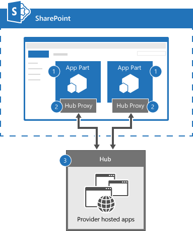

# Connect SharePoint app parts by using SignalR

Implement real-time communication between SharePoint app parts by using SignalR.

_**Applies to:** add-ins for SharePoint | SharePoint 2013 | SharePoint Online_

The  [Core.ConnectedAppParts](https://github.com/OfficeDev/PnP/tree/master/Samples/Core.ConnectedAppParts) sample shows you how to use a provider-hosted app as a message broker or chat hub to send and receive messages from all app parts connected to the chat hub. Use this solution if you are converting your SharePoint web parts to app parts, and need your app parts to communicate with each other.

## Before you begin
<a name="sectionSection0"> </a>

To get started, download the  [Core.ConnectedAppParts](https://github.com/OfficeDev/PnP/tree/master/Samples/Core.ConnectedAppParts) sample app from the [Office 365 Developer patterns and practices](https://github.com/OfficeDev/PnP/tree/dev) project on GitHub.

## Connected app parts and chat hub architecture
<a name="sectionSection1"> </a>

Figure 1 shows the connected app parts and chat hub architecture.

**Figure 1. Connected app parts and chat hub architecture**



The connected app parts and chat hub architecture includes the following components:

1. SharePoint pages that include app parts. The app parts use the SignalR jQuery library. The app parts contain JavaScript code, which send and receive messages from the chat hub running in the provider-hosted add-in. Each app part must first connect to the chat hub. After connecting to the chat hub, app parts can send and receive messages from other connected app parts.
    
2. A SignalR Hub Proxy, which establishes a socket connection to the chat hub. The SignalR Hub Proxy brokers messages between the app part's JavaScript code and the chat hub's C# code.
    
3. The chat hub, which uses the SignalR library to route messages from sending to receiving app parts. In this code sample, all app parts receive messages from the chat hub, including the app part that sent the message.
    
**Note**  Because app parts run in an IFRAME, you cannot use JavaScript only to communicate between app parts. 

## Use the Core.ConnectedAppParts app
<a name="sectionSection2"> </a>

To see a demo of two app parts communicating by using SignalR: 

1. When you run the app and the start page is displayed, choose  **Back to Site**.
    
2. Choose  **Settings** > **Add a page**.
    
3. In  **New page name**, enter  **ConnectedAppParts**, and then choose  **Create**.
    
4. Choose  **Insert** > **App Part**.
    
5. Choose  **Connected Part - One** > **Add**.
    
6. Choose  **Insert** > **App Part**.
    
7. Choose  **Connected Part - Two** > **Add**.
    
8. Choose  **Save**.
    
9. In  **Connected Part - One**, enter  **Hello World from App Part 1**, and then choose  **Send**.
    
10. Verify that the message  **Hello World from App Part 1** appears in both **Connected Part - One** and **Connected Part - Two** app parts.
    
In this code sample, the Core.ConnectedAppParts project contains two app parts (ConnectedPartOne and ConnectedPartTwo) that are deployed to the host web. ConnectedPartOne and ConnectedPartTwo run in an IFRAME. The web page contents for ConnectedPartOne and ConnectedPartTwo are defined in the Core.ConnectedAppPartsWeb project in Pages\ConnectedPartOne.aspx and Pages\ConnectedPartTwo.aspx. Both pages run in the provider-hosted app with the chat hub (ChatHub.cs) and use inline JavaScript to:

1. Include the SignalR jQuery library.
    
2. Connect to the SignalR Hub Proxy using  **connection.chatHub**. 
    
3. Use  **chat.client.broadcastMessage** to define a function to receive broadcasted messages sent by the chat hub. In this code sample, the name of the app part and the message being broadcasted is displayed in the **discussion** list.
    
4. Start the connection to the chat hub using  **$.connection.hub.start().done**. When the connection is established, an event handler is defined on the  **sendmessage** button's click event. This event handler calls **chat.server.send** to send the name of the app part and the message entered by the user to the chat hub.

**Note**  The code in this article is provided as-is, without warranty of any kind, either express or implied, including any implied warranties of fitness for a particular purpose, merchantability, or non-infringement.

```
    <!--Script references. -->
    <!--Reference the jQuery library. -->
    <script src="../Scripts/jquery-1.6.4.min.js" ></script>
    <!--Reference the SignalR library. -->
    <script src="../Scripts/jquery.signalR-2.0.3.min.js"></script>
    <!--Reference the autogenerated SignalR hub script. -->
    <script src="../signalr/hubs"></script>
    <!--Add script to update the page and send messages.--> 
    <script type="text/javascript">
        $(function () {
            // Declare a proxy to reference the hub. 
            var chat = $.connection.chatHub;
            // Create a function that the hub can call to broadcast messages.
            chat.client.broadcastMessage = function (name, message) {
                // Html encode display name and message. 
                var encodedName = $('<div />').text(name).html();
                var encodedMsg = $('<div />').text(message).html();
                // Add the message to the page. 
                $('#discussion').append('<li><strong>' + encodedName
                    + '</strong>:&amp;nbsp;&amp;nbsp;' + encodedMsg + '</li>');
            };
            // Set initial focus to message input box.  
            $('#message').focus();
            // Start the connection.
            $.connection.hub.start().done(function () {
                $('#sendmessage').click(function () {
                    // Call the Send method on the hub. 
                    chat.server.send($('#displayname').val(), $('#message').val());
                    // Clear text box and reset focus for next comment. 
                    $('#message').val('').focus();
                });
            });
        });
    </script>
```

When the inline JavaScript code in ConnectedPartOne.aspx runs  **chat.server.send**, a call is made to the  **Send** method in ChatHub.cs. The **Send** method in ChatHub.cs receives the broadcasting app part's name and the message, and then broadcasts the information to all connected app parts by using **Clients.All.broadcastMessage**.  **Clients.All.broadcastMessage** calls the JavaScript function (in all connected app parts) that was defined by using **chat.client.broadcastMessage**.

```C#
 public void Send(string name, string message)
        {
            // Call the broadcastMessage method to update the app parts.
            Clients.All.broadcastMessage(name, message);
        }
```

**Important**  In this code sample, all app parts connected to the chat hub receive all messages sent through the chat hub. Consider filtering messages based on session ID to determine which app parts should receive which messages.

## Additional resources
<a name="bk_addresources"> </a>

-  [Office 365 development patterns and practices solution guidance](Office-365-development-patterns-and-practices-solution-guidance.md)
    
-  [Introduction to SignalR](http://www.asp.net/signalr/overview/getting-started/introduction-to-signalr)
    
-  [Tutorial: Getting Started with SignalR 2](http://www.asp.net/signalr/overview/getting-started/tutorial-getting-started-with-signalr)
    
